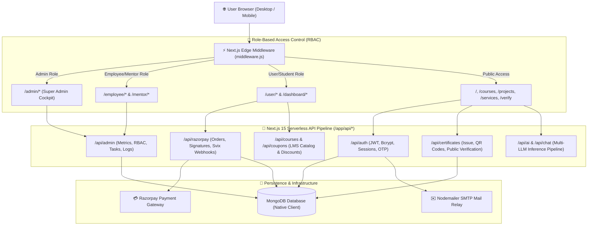
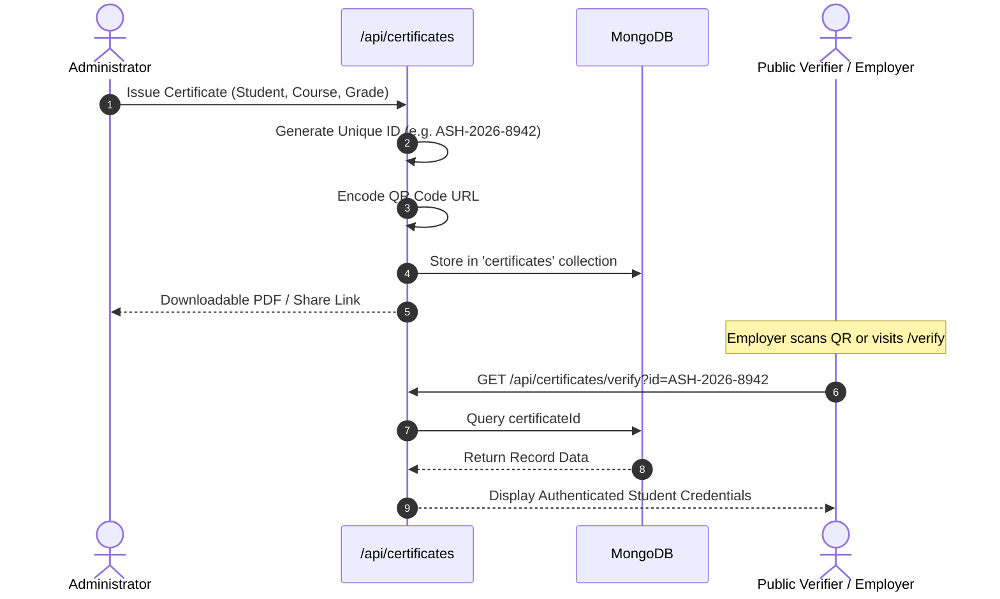

# 📘 AmitSolution Hub — Comprehensive Technical Documentation

> **Version:** 1.0.0  
> **Platform:** Next.js 15 (App Router + Turbopack) | React 19 | Tailwind CSS 4 | MongoDB  
> **Author & Maintainer:** Amit Solution Hub Engineering Team  
> **Last Updated:** 2026

---

## 📑 Table of Contents

1. [System Architecture & Overview](#1-system-architecture--overview)
2. [Technology Stack & Core Dependencies](#2-technology-stack--core-dependencies)
3. [Project Directory Structure](#3-project-directory-structure)
4. [Routing & Edge Middleware (RBAC)](#4-routing--edge-middleware-rbac)
5. [Backend API Reference & Data Flow](#5-backend-api-reference--data-flow)
6. [Database Schema & Collections](#6-database-schema--collections)
7. [AshnexaRobot Mascot Component Documentation](#7-ashnexarobot-mascot-component-documentation)
8. [Credential & QR Certificate Verification Engine](#8-credential--qr-certificate-verification-engine)
9. [Payment Gateway & Webhook Integration (Razorpay)](#9-payment-gateway--webhook-integration-razorpay)
10. [AI Integration Pipeline (Gemini, Claude, Bedrock)](#10-ai-integration-pipeline-gemini-claude-bedrock)
11. [State Management & Context Providers](#11-state-management--context-providers)
12. [Environment Configuration & Deployment](#12-environment-configuration--deployment)

---

## 1. System Architecture & Overview

**AmitSolution Hub** is an integrated multi-tier enterprise web application uniting:
- **IT Services & Software Solutions:** Custom web engineering, DevOps, repair, video editing.
- **Digital Marketplace:** Direct delivery of software projects and custom quote workflows.
- **EdTech LMS & 1-on-1 Mentorship:** Structured courses, interactive coding modules, and student progression.
- **Verifiable Digital Credentials:** Dynamic QR-coded, tamper-proof certificate issuance and instant verification.
- **Contextual 3D Vector Mascot:** Real-time 3D interactive SVG character (`AshnexaRobot`).

### High-Level Architecture Diagram



---

## 2. Technology Stack & Core Dependencies

### Core Frameworks & Runtime
- **Next.js (`^15.1.7`):** App Router, Server Components, Route Handlers, Edge Middleware, and Turbopack compiler.
- **React (`^19.0.0`) & React DOM (`^19.0.0`):** Modern React concurrent rendering and action primitives.
- **Node.js (`>=20.x`, recommended `22.x`):** Server runtime.

### UI, Styling & Animation
- **Tailwind CSS (`^4.2.1`):** Next-gen CSS engine with zero-config Vite/PostCSS support.
- **Framer Motion (`^12.38.0`):** Page transitions, parallax scrolling, and viewport triggers (`useInView`).
- **Lucide React (`^1.7.0`):** Standardized, tree-shakeable vector icons.

### Data, Auth & Storage
- **MongoDB Native Driver (`^7.3.0`):** Direct high-throughput database connection pooling via [`lib/db/mongo.js`](file:///f:/GithubClone/0726/amitsolutionhub/lib/db/mongo.js).
- **JSON Web Token (`jsonwebtoken ^9.0.3`):** Cryptographic session signing and verification.
- **BcryptJS (`^3.0.3`):** 12-round salted hashing for secure password storage.

### Payments & External Services
- **Razorpay (`^2.9.6`):** Unified checkout, orders creation, and HMAC SHA256 payment verification.
- **Svix (`^1.15.0`):** Secure webhook signature validation.
- **Nodemailer (`^8.0.11`):** Transactional email dispatcher with custom HTML templates.

### AI & Machine Learning
- **Google Generative AI (`@google/generative-ai ^0.24.1`):** Gemini models powering the 24/7 client assistant.
- **Anthropic AI SDK (`@anthropic-ai/sdk ^0.105.0`):** Claude API integration.
- **AWS Bedrock Runtime (`@aws-sdk/client-bedrock-runtime ^3.1073.0`):** Multi-cloud LLM support.

### Document Generation & Optical Scanner
- **jsPDF (`^4.2.1`) & html2canvas (`^1.4.1`) / html-to-image (`^1.11.13`):** Certificate and invoice PDF generation.
- **qrcode.react (`^4.2.0`):** Dynamic SVG/Canvas QR code generation.
- **Tesseract.js (`^7.0.0`):** In-browser Optical Character Recognition (OCR) for document verification.

---

## 3. Project Directory Structure

```text
amitsolutionhub/
├── app/                           # Next.js App Router (Pages, Layouts & APIs)
│   ├── api/                       # Serverless Backend API Endpoints
│   │   ├── admin/                 # Admin operations (Metrics, Users, Tasks, Logs)
│   │   ├── ai/                    # Multi-LLM inference routes
│   │   ├── auth/                  # Login, registration, password recovery, session check
│   │   ├── certificates/          # Certificate issuance and QR verification
│   │   ├── chat/                  # Real-time and persistent chat storage
│   │   ├── coupons/               # Coupon creation, validation, and discount calculation
│   │   ├── db/                    # Database maintenance endpoints
│   │   ├── mentor/                # Mentorship sessions and student review
│   │   ├── notify/                # Push and email notifications
│   │   ├── razorpay/              # Checkout orders, payment verification, webhooks
│   │   ├── upload/                # Media and asset uploads
│   │   └── users/                 # Profile and account updates
│   ├── admin/                     # Super Admin cockpit views
│   ├── employee/                  # Staff & mentor workspaces
│   ├── user/                      # Student & customer personal dashboard
│   ├── courses/                   # Course directory and detail pages
│   ├── projects/                  # Software marketplace and custom project builder
│   ├── services/                  # IT and digital service descriptions
│   ├── verify/                    # Public QR certificate verification interface
│   ├── layout.jsx                 # Root layout with providers, SEO, and font tokens
│   └── page.jsx                   # Homepage landing route
├── src/                           # Client Application Source Code
│   ├── admin/                     # Admin UI modules (Analytics, Permissions, Sales, Team)
│   ├── employee/                  # Employee UI modules (Tasks, Mentorship, Internal Chat)
│   ├── user/                      # Student UI modules (My Courses, Certificates, Orders)
│   ├── components/                # Shared Component Library
│   │   ├── robot/                 # AshnexaRobot.jsx (Vector 3D SVG mascot)
│   │   ├── Hero.jsx               # Hero section
│   │   ├── AIChatbot.jsx          # Interactive floating AI assistant
│   │   ├── VerifiedCertificate.jsx# Interactive certificate preview & download
│   │   └── Layout.jsx             # Public page layout with navbar, footer, notice banners
│   ├── context/                   # Global React Contexts (AuthContext, ThemeContext, ChatContext)
│   ├── store/                     # Reactive state management (StoreContext)
│   ├── utils/                     # Role normalizers, token helpers, formatters
│   └── views/                     # Public view pages (About, Contact, Services, Projects)
├── lib/                           # Shared Server-Side Libraries
│   ├── db/                        # mongo.js (Cached MongoDB connection pool)
│   ├── email.js                   # Nodemailer transporter configuration
│   └── emailTemplate.js           # Transactional HTML email templates
├── scripts/                       # Maintenance & Automation Scripts
│   └── createAdmin.mjs            # Super admin database initialization script
├── middleware.js                  # Edge Middleware for Route Guarding & RBAC
├── next.config.mjs                # Next.js configuration settings
├── tailwind.config.js             # Tailwind CSS tokens, typography, and color palette
├── README.md                      # Public project documentation
└── DOCUMENTATION.md               # Complete internal technical documentation
```

---

## 4. Routing & Edge Middleware (RBAC)

Route security is enforced at the network edge using Next.js Middleware in [`middleware.js`](file:///f:/GithubClone/0726/amitsolutionhub/middleware.js):

```javascript
import { NextResponse } from 'next/server';

export function middleware(request) {
  const { pathname } = request.nextUrl;
  const token = request.cookies.get('token')?.value || 
                request.headers.get('authorization')?.replace('Bearer ', '');

  // Guard Admin routes
  if (pathname.startsWith('/admin')) {
    if (!token) {
      const loginUrl = new URL('/login', request.url);
      loginUrl.searchParams.set('redirect', pathname);
      return NextResponse.redirect(loginUrl);
    }
  }

  // Guard Employee & Mentor routes
  if (pathname.startsWith('/employee')) {
    if (!token) {
      const loginUrl = new URL('/login', request.url);
      loginUrl.searchParams.set('redirect', pathname);
      return NextResponse.redirect(loginUrl);
    }
  }

  // Guard User personal dashboard routes
  if (pathname.startsWith('/user')) {
    if (!token) {
      const loginUrl = new URL('/login', request.url);
      loginUrl.searchParams.set('redirect', pathname);
      return NextResponse.redirect(loginUrl);
    }
  }

  return NextResponse.next();
}

export const config = {
  matcher: ['/admin/:path*', '/employee/:path*', '/user/:path*'],
};
```

### Self-Healing Client-Side Module Loader (`lazyWithRetry`)
When new production code is deployed to Vercel/Node.js, existing user sessions might encounter chunk hash mismatches (`ChunkLoadError`). In [`src/App.jsx`](file:///f:/GithubClone/0726/amitsolutionhub/src/App.jsx#L60), an enhanced lazy loader automatically detects chunk loading failures and executes a controlled cache-busting refresh:

```javascript
const lazyWithRetry = (componentImport) =>
  lazy(async () => {
    const pageHasBeenForceRefreshed = JSON.parse(
      window.sessionStorage.getItem('page-has-been-force-refreshed') || 'false'
    );
    try {
      const component = await componentImport();
      window.sessionStorage.setItem('page-has-been-force-refreshed', 'false');
      return component;
    } catch (error) {
      if (!pageHasBeenForceRefreshed) {
        window.sessionStorage.setItem('page-has-been-force-refreshed', 'true');
        window.location.reload();
        return { default: () => null };
      }
      throw error;
    }
  });
```

---

## 5. Backend API Reference & Data Flow

### Authentication APIs (`/app/api/auth`)
| Method | Endpoint | Description | Auth Required |
| :--- | :--- | :--- | :--- |
| `POST` | `/api/auth/login` | Validates email & bcrypt password, returns JWT token | ❌ Public |
| `POST` | `/api/auth/register` | Registers new student/client account | ❌ Public |
| `GET` | `/api/auth/me` | Fetches current user profile from token | ✅ Bearer / Cookie |
| `POST` | `/api/auth/forgot-password` | Dispatches password reset link via Nodemailer | ❌ Public |
| `POST` | `/api/auth/reset-password` | Validates reset token and sets new password | ❌ Public |

### Payments APIs (`/app/api/razorpay`)
| Method | Endpoint | Description | Auth Required |
| :--- | :--- | :--- | :--- |
| `POST` | `/api/razorpay/create-order` | Generates a Razorpay Order ID for courses or projects | ✅ User |
| `POST` | `/api/razorpay/verify-payment` | Validates HMAC SHA256 payment signature | ✅ User |
| `POST` | `/api/razorpay/webhook` | Handles asynchronous payment capture via Svix | ❌ Svix Signature |

### Certificate Verification APIs (`/app/api/certificates`)
| Method | Endpoint | Description | Auth Required |
| :--- | :--- | :--- | :--- |
| `GET` | `/api/certificates/verify?id={id}` | Returns verified student name, course, and issue date | ❌ Public |
| `POST` | `/api/certificates/issue` | Issues new credential with cryptographically signed ID | ✅ Admin |

### AI & Assistant APIs (`/app/api/ai` & `/app/api/chat`)
| Method | Endpoint | Description | Auth Required |
| :--- | :--- | :--- | :--- |
| `POST` | `/api/ai/chat` | Streams conversational AI responses from Google Gemini | ❌ Public |
| `POST` | `/api/chat/save` | Persists user chat history to MongoDB | ✅ User |

---

## 6. Database Schema & Collections

MongoDB is accessed through a cached singleton client in [`lib/db/mongo.js`](file:///f:/GithubClone/0726/amitsolutionhub/lib/db/mongo.js). Primary collections include:

### 1. `users` Collection
```json
{
  "_id": "ObjectId(...)",
  "displayName": "Amit Patel",
  "email": "user@example.com",
  "password": "$2a$12$eXamPLeHasHeDpaSswORd...",
  "role": "admin | employee | mentor | user",
  "permissions": ["manage_users", "issue_certificates", "edit_courses"],
  "enrolledCourses": ["course_id_1", "course_id_2"],
  "purchasedProjects": ["project_id_1"],
  "isActive": true,
  "emailVerified": true,
  "createdAt": "2026-01-15T00:00:00.000Z",
  "updatedAt": "2026-03-20T00:00:00.000Z"
}
```

### 2. `certificates` Collection
```json
{
  "_id": "ObjectId(...)",
  "certificateId": "ASH-2026-8942",
  "studentName": "Rahul Sharma",
  "studentEmail": "rahul@example.com",
  "courseTitle": "Full Stack Cloud & AI Architecture",
  "issueDate": "2026-03-15T00:00:00.000Z",
  "grade": "A+",
  "qrCodeUrl": "https://amitsolutionhub.com/verify?id=ASH-2026-8942",
  "isRevoked": false
}
```

### 3. `orders` Collection
```json
{
  "_id": "ObjectId(...)",
  "userId": "ObjectId(...)",
  "orderId": "order_Rzp1234567890",
  "paymentId": "pay_Rzp1234567890",
  "amount": 499900,
  "currency": "INR",
  "status": "paid",
  "items": [
    { "type": "course", "itemId": "course_ai_arch_101", "name": "AI Systems" }
  ],
  "invoiceNumber": "INV-2026-0042",
  "createdAt": "2026-03-10T12:00:00.000Z"
}
```

---

## 7. AshnexaRobot Mascot Component Documentation

**Component Path:** [`src/components/robot/AshnexaRobot.jsx`](file:///f:/GithubClone/0726/amitsolutionhub/src/components/robot/AshnexaRobot.jsx)  
**Export:** Default Component (`AshnexaRobot`) & Named Component (`RobotBaseGraphic`)

### Architectural Blueprint
```text
┌────────────────────────────────────────────────────────┐
│ AshnexaRobot Container (Perspective: 1200px)           │
│  ├── Ambient Blur Glow Backdrop (#6366F1, #38BDF8)     │
│  ├── SVG Robot Canvas (Dynamic 3D Tilt Transform)      │
│  │    ├── Head: Body Armor Shell + Visor + Eye Optics  │
│  │    ├── Torso: Armor Plate + Glowing Core Reactor    │
│  │    ├── Dynamic Arms: 7 Scenario-Specific Modifiers  │
│  │    └── Base: Thruster Ring + Anti-Gravity Jet Cone  │
│  └── Section 3D Overlay Badges & Terminal Consoles     │
└────────────────────────────────────────────────────────┘
```

### Component Props (API Specification)
```typescript
interface AshnexaRobotProps {
  action?: 'hero-coding' | 'projects-architecture' | 'programs-mentor' | 
           'services-cloud' | 'why-us-shield' | 'certificate-scanner' | 
           'contact-support';
  className?: string;
  badgeTitle?: string;
  badgeSubtitle?: string;
}
```

### 3D Cursor Parallax Formula
```javascript
const handleMouseMove = (e) => {
  const rect = e.currentTarget.getBoundingClientRect();
  const x = (e.clientX - rect.left) / rect.width - 0.5;   // Range: -0.5 to +0.5
  const y = (e.clientY - rect.top) / rect.height - 0.5;   // Range: -0.5 to +0.5
  setMousePos({ x, y });
};

// Applied to the SVG element:
// transform: `rotateY(${mousePos.x * 12}deg) rotateX(${-mousePos.y * 10}deg)`
```

### All 7 Action States & Scenarios

| Action Name | Contextual Page | Arm Pose & Equipment | Accompanying 3D Floating Overlays |
| :--- | :--- | :--- | :--- |
| `hero-coding` | Homepage Hero | Laser coding finger emitting glowing digital code beam | 3D Laptop terminal running `Ashnexa.tsx`, AI Engine badge, System Verified badge |
| `projects-architecture` | Projects Page | Left hand holds digital pad, right hand projects holographic pointer | 3D live architecture card (API Gateway 200 OK, Microservices 4 Nodes, PostgreSQL Synced) |
| `programs-mentor` | EdTech / Mentorship | Holds curriculum ledger, gestures forward with stylus | 1-on-1 Mentorship hologram, active learner avatar, 92% curriculum progress bar |
| `services-cloud` | Cloud Services Page | Tuning server rack node and managing deployment pipelines | Holographic Cloud Cluster console (16 K8s Pods, 14ms latency, CI/CD auto-deploy) |
| `why-us-shield` | Trust & Security | Left arm holds glowing digital shield forward | Large glowing Security & Reliability shield, 100% Production Ready badge |
| `certificate-scanner` | Certificate Verifier | Holds document tray and handheld emerald laser scanner | Scanned ID pill card (`ASH-2026-8942 Valid ✓`), emerald laser sweep line |
| `contact-support` | Contact Page | Wearing headset and boom microphone, touches ear receiver | Support desk reflection, chat bubble *"How can we assist your tech journey today? 💬"* |

---

## 8. Credential & QR Certificate Verification Engine

The credential workflow ensures authentic certificates that cannot be counterfeited:



---

## 9. Payment Gateway & Webhook Integration (Razorpay)

### Transaction Lifecycle:
1. **Order Initiation:** User selects a course/project. The client calls `/api/razorpay/create-order` with the item ID.
2. **Checkout Modal:** The Razorpay checkout modal opens with company branding and amount in paise (`INR`).
3. **Cryptographic Signature Verification:** Upon payment completion, Razorpay returns `razorpay_order_id`, `razorpay_payment_id`, and `razorpay_signature`.
4. **Validation:** The server hashes `order_id + "|" + payment_id` using the secret key via HMAC SHA256. If the signature matches, the purchase is unlocked instantly.
5. **Webhook Fallback:** In case of network interruption, Svix webhook events (`payment.captured`) reconcile orders automatically.

---

## 10. AI Integration Pipeline (Gemini, Claude, Bedrock)

AmitSolution Hub provides intelligent user assistance through a unified AI handler:
- **Client Widget (`AIChatbot.jsx`):** A floating, collapsible chat widget offering instant guidance on courses, services, and support.
- **Multi-Model Orchestration:** Defaults to Google Gemini Flash for lightning-fast latency; falls back to Claude or AWS Bedrock for complex reasoning queries.
- **Admin AI Departments:** Allows administrative configuration of tailored prompts and knowledge domains (e.g., Sales AI, Tech Support AI).

---

## 11. State Management & Context Providers

The application employs clean React Context layers:
- **`AuthContext` ([`src/context/AuthContext.jsx`](file:///f:/GithubClone/0726/amitsolutionhub/src/context/AuthContext.jsx)):** Manages authentication state, user roles, token renewals, and logout actions.
- **`StoreContext` ([`src/store/StoreContext.jsx`](file:///f:/GithubClone/0726/amitsolutionhub/src/store/StoreContext.jsx)):** Global state for shopping cart items, selected courses, and UI modals.
- **`ThemeContext` ([`src/context/ThemeContext.jsx`](file:///f:/GithubClone/0726/amitsolutionhub/src/context/ThemeContext.jsx)):** Seamless dark/light theme switching with local storage persistence.
- **`ChatContext` ([`src/context/ChatContext.jsx`](file:///f:/GithubClone/0726/amitsolutionhub/src/context/ChatContext.jsx)):** Real-time customer support conversations and message queues.

---

## 12. Environment Configuration & Deployment

### Environment Variable Checklist
Create `.env.local` in the project root:

```env
# Server
PORT=3000
NODE_ENV=production
NEXT_PUBLIC_APP_URL=https://amitsolutionhub.com

# Database
MONGODB_URI=mongodb+srv://<user>:<password>@cluster.mongodb.net/ashnexasystems

# Security & Secrets
JWT_SECRET=production_grade_jwt_secret_key_minimum_32_characters
COOKIE_SECRET=production_cookie_secret_key

# Razorpay
RAZORPAY_KEY_ID=rzp_live_yourKeyId
RAZORPAY_KEY_SECRET=yourRazorpayLiveSecret
RAZORPAY_WEBHOOK_SECRET=yourWebhookSecret

# Artificial Intelligence
GEMINI_API_KEY=your_gemini_api_key
ANTHROPIC_API_KEY=your_anthropic_api_key

# Nodemailer SMTP
SMTP_HOST=smtp.gmail.com
SMTP_PORT=587
SMTP_USER=contact@amitsolutionhub.com
SMTP_PASS=your_app_password
SMTP_FROM_EMAIL="AmitSolution Hub" <no-reply@amitsolutionhub.com>
```

### Production Build & Launch
```bash
# 1. Install dependencies
npm install

# 2. Build optimized bundle
npm run build

# 3. Start production server
npm run start
```

---

## 📄 License & Attribution

Copyright © 2026 **AmitSolution Hub**. All Rights Reserved.  
Engineered with precision for reliability, performance, and scalability.
