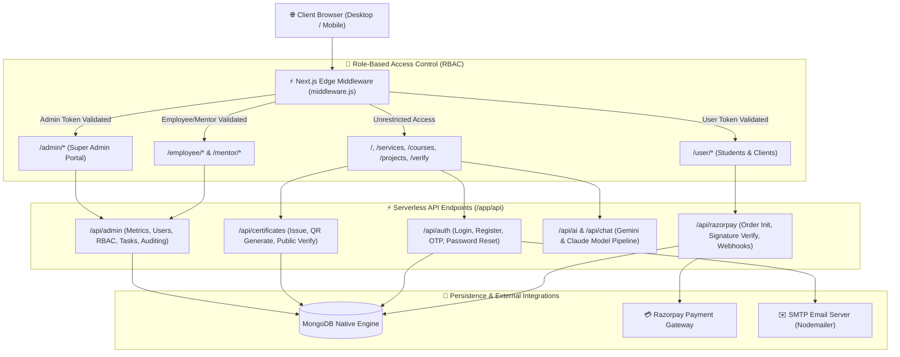

# ⚡ AmitSolution Hub (Amit Solution Hub)

<div align="center">


<p align="center">
  <b>Next-Generation Enterprise IT Solutions, Digital Product Marketplace, EdTech Mentorship, and QR-Verified Digital Credentials Platform.</b>
</p>

[🌐 Live Website](https://amitsolutionhub.com) • [📖 System Architecture](#-system-architecture) • [🚀 Quick Start](#-quick-start) • [🛡️ RBAC & Security](#-role-based-access-control-rbac) • [🤖 Ashnexa Mascot](#-interactive-3d-mascot-ashnexarobot)

</div>

---

## 📋 Table of Contents

1. [Project Overview](#-project-overview)
2. [Core Feature Highlights](#-core-feature-highlights)
3. [Interactive 3D Mascot (`AshnexaRobot`)](#-interactive-3d-mascot-ashnexarobot)
4. [Technology Stack](#-technology-stack)
5. [System Architecture](#-system-architecture)
6. [Portals & Role-Based Access Control (RBAC)](#-portals--role-based-access-control-rbac)
7. [Environment Configuration](#-environment-configuration)
8. [Quick Start Guide](#-quick-start-guide)
9. [Available Scripts & CLI Commands](#-available-scripts--cli-commands)
10. [Repository Directory Structure](#-repository-directory-structure)
11. [Security & Best Practices](#-security--best-practices)
12. [License & Attribution](#-license--attribution)

---

## 🌟 Project Overview

**AmitSolution Hub** (Amit Solution Hub) is a full-featured, enterprise-grade modern web platform integrating IT services, digital software marketplace, educational technology (EdTech) mentorship, and verifiable digital credentials into a unified ecosystem.

Designed with cutting-edge web technologies (**Next.js 15 App Router**, **React 19**, and **Tailwind CSS 4**), the platform delivers:
- **IT Consulting & Engineering:** Full-stack development, cloud computing, DevOps automation, video editing, and hardware repair solutions.
- **Ready-Made & Custom Projects:** Software marketplace with instant source-code delivery and custom project requirement estimation.
- **EdTech & Career Mentorship:** 1-on-1 industry mentorship, comprehensive training bootcamps, interactive code labs, and coupon management.
- **Verifiable QR Credentials:** Tamper-proof digital certificates featuring dynamic QR codes, instant PDF generation, and a public verification engine.
- **High-Performance Vector 3D Mascot:** A fully reactive 3D SVG mascot (`AshnexaRobot`) with mouse parallax, hardware-accelerated animations, and section-specific contextual states.

---

## 🚀 Core Feature Highlights

### 1. 🎓 EdTech & Learning Management System (LMS)
- Structured course catalog with categorisation and search.
- Discount and promotional coupon engine (`/api/coupons`).
- Student progress tracking, interactive assignments, and completion badges.

### 2. 🛡️ QR-Verified Digital Credential System
- Automated certificate issuance upon program completion with unique IDs (e.g., `ASH-2026-XXXX`).
- Client-side and server-side PDF generation using `jspdf`, `html2canvas`, and `html-to-image`.
- Public certificate verification page (`/verify`) with optical scanner styling and instant database verification.

### 3. 💳 Secure Payments & Financial Management
- Seamless integration with **Razorpay SDK** for UPI, debit/credit cards, and net banking.
- Secure payment verification utilizing cryptographic HMAC SHA256 signatures.
- Svix-powered webhook processing for real-time order status updates.
- Automated invoice and receipt creation for accounting and auditing.

### 4. 🤖 Multi-LLM Artificial Intelligence
- Integration with **Google Gemini** (`@google/generative-ai`), **Anthropic Claude**, and **AWS Bedrock**.
- Smart 24/7 floating customer support chatbot (`AIChatbot`).
- Custom AI Departments configuration manageable directly via the admin dashboard.

### 5. ⚡ Performance & Reliability Architecture
- Automated dynamic import chunk error recovery (`lazyWithRetry`) that handles new production deployments gracefully.
- Turbopack-powered high-speed hot module replacement (HMR) and optimized build bundles.
- Global maintenance mode toggle and real-time announcement popups.

---

## 🤖 Interactive 3D Mascot (`AshnexaRobot`)

Located in [`src/components/robot/AshnexaRobot.jsx`](file:///f:/GithubClone/0726/amitsolutionhub/src/components/robot/AshnexaRobot.jsx), this mascot is built entirely with **pure SVG vector graphics and CSS3 3D transforms** without the overhead of heavy `.glb`/`.gltf` 3D model bundles.

```text
               .---.
              /_____\
             | [o][o] |  <-- Dynamic blinking eye optics
           .-|   --   |-.
          /  '-------'  \
         |   .-''''-.   | <-- Glowing Reactor Core ("A" Logo)
         |  |   /\   |  |
         '--|  /__\  |--'
            '--------'
               /||\     <-- Anti-gravity hover repulsor thruster
```

### Key Capabilities:
- **Interactive Mouse Parallax:** Dynamically tilts in 3D perspective (`rotateY`, `rotateX`) responding to user cursor coordinates.
- **Adaptive Action Modes (7 Distinct Poses):**
  1. `hero-coding`: Coding pose with animated 3D laptop, code streaming beam, and operational badges.
  2. `projects-architecture`: Holographic pointer analyzing a live full-stack system architecture card.
  3. `programs-mentor`: 1-on-1 mentorship holographic display featuring curriculum progress and student wireframe.
  4. `services-cloud`: Cloud operations console monitoring Kubernetes pods, cluster latency, and CI/CD pipelines.
  5. `why-us-shield`: Glowing enterprise digital shield symbolizing 99.99% uptime and zero downtime.
  6. `certificate-scanner`: Emerald fan laser beam performing instant document ID verification.
  7. `contact-support`: Equipped with a modern headset, floating chat bubbles, and 24/7 support desk reflections.
- **Viewport Optimization:** Uses `useInView` to automatically pause animation loops when scrolled off-screen, conserving CPU and battery resources.

---

## 🛠️ Technology Stack

| Layer | Technology | Details |
| :--- | :--- | :--- |
| **Frontend Framework** | [Next.js 15.1.7](https://nextjs.org/) (App Router + Turbopack) | Server-Side Rendering, Hybrid SPA routing, Edge Middleware |
| **UI Library** | [React 19.0.0](https://react.dev/) | Latest concurrent features and component primitives |
| **Styling Engine** | [Tailwind CSS 4.2.1](https://tailwindcss.com/) | Modern CSS tokens, PostCSS integration, dark mode support |
| **Animations** | [Framer Motion 12.38](https://www.framer.com/motion/) | Motion orchestrations, viewport triggers, page transitions |
| **Icons** | [Lucide React](https://lucide.dev/) | Clean, scalable, tree-shakeable SVG iconography |
| **Database** | [MongoDB 7.3.0](https://www.mongodb.com/) (Native Driver) | High-concurrency NoSQL document store |
| **Authentication** | JWT (`jsonwebtoken`) + `bcryptjs` | Stateless token authentication with salted password hashing |
| **Payments** | [Razorpay](https://razorpay.com/) + [Svix](https://svix.com/) | Payment gateway, signature validation, secure webhooks |
| **AI Systems** | Google Gemini, Anthropic Claude, AWS Bedrock | Generative AI chat and intelligent assistance |
| **Email Services** | [Nodemailer](https://nodemailer.com/) | Custom-branded HTML email delivery via SMTP |
| **Document Export** | `jspdf`, `html2canvas`, `html-to-image` | High-fidelity certificate and invoice rendering |
| **Computer Vision** | [Tesseract.js](https://tesseract.projectnaptha.com/) | Client-side OCR for certificate and document scanning |

---

## 🏗️ System Architecture



---

## 👥 Portals & Role-Based Access Control (RBAC)

The application enforces a granular 4-tier role hierarchy managed through Next.js Edge Middleware and client-side route guards:

### 1. Super Admin (`/admin`)
- Real-time revenue, enrollment, order, and visitor analytics.
- Staff & employee onboarding, role assignments, and granular permissions editor.
- Complete catalog governance: projects, courses, syllabus modules, and coupon promotions.
- Official digital certificate generator with unique registration numbers and QR metadata.
- Account requests, service inquiries, and project sale approval workflows.

### 2. Employee & Mentor (`/employee` & `/mentor`)
- Personal task backlog, ticket resolution, and workflow status updates.
- Dedicated mentorship cockpit: 1-on-1 scheduled sessions, progress evaluation, and student feedback.
- Company-wide broadcast messaging and real-time internal team chat.
- Sell Project submissions for internal review.

### 3. Student & Client (`/user`)
- Enrolled courses overview with interactive lessons and curriculum progression.
- Order history, purchased source code repository access, and downloadable tax invoices.
- Verified certificates locker with one-click PDF downloads and public verification share links.
- Custom project proposal tracker and direct communications channel.

### 4. Public Visitors
- Exploration of service offerings, portfolio showcases, technology blogs, and pricing calculators.
- Public certificate validation terminal (`/verify`) allowing third-party employers to verify legitimacy.
- Instant access to the 24/7 AI-powered assistance widget.

---

## 🔑 Environment Configuration

Create a `.env` or `.env.local` file in the root directory and configure the following environment keys:

```env
# ─── Server & Application ───
PORT=3000
NODE_ENV=development
NEXT_PUBLIC_APP_URL=http://localhost:3000

# ─── Database Configuration ───
MONGODB_URI=mongodb://127.0.0.1:27017/ashnexasystems
# Or for MongoDB Atlas Cloud:
# MONGODB_URI=mongodb+srv://<username>:<password>@cluster.mongodb.net/ashnexasystems

# ─── Security & Authentication ───
JWT_SECRET=your_super_secure_jwt_secret_key_here
COOKIE_SECRET=your_cookie_encryption_secret_key

# ─── Razorpay Payment Gateway ───
RAZORPAY_KEY_ID=rzp_test_yourKeyId
RAZORPAY_KEY_SECRET=yourRazorpayKeySecret
RAZORPAY_WEBHOOK_SECRET=yourWebhookSecret

# ─── Generative AI API Keys ───
GEMINI_API_KEY=your_google_gemini_api_key
ANTHROPIC_API_KEY=your_anthropic_claude_api_key

# ─── SMTP Mail Server (Nodemailer) ───
SMTP_HOST=smtp.gmail.com
SMTP_PORT=587
SMTP_USER=your-email@gmail.com
SMTP_PASS=your-gmail-app-password
SMTP_FROM_EMAIL=no-reply@ashnexasystems.com
```

---

## ⚡ Quick Start Guide

### Prerequisites
- **Node.js:** v18.18.0 or v20+ (v22.x recommended)
- **MongoDB:** Local MongoDB instance (default port `27017`) or a MongoDB Atlas connection string
- **Package Manager:** `npm`, `pnpm`, or `yarn`

### 1. Clone the Repository
```bash
git clone https://github.com/Amit-Patel01/amitsolutionhub.git
cd amitsolutionhub
```

### 2. Install Dependencies
```bash
npm install
```

### 3. Seed Default Super Admin Account
Execute the administrative account creator script to initialize your database:
```bash
node scripts/createAdmin.mjs
```
> **Default Admin Credentials:**
> - **Email:** `admin@ashnexasystems.com`
> - **Password:** `Ashnexa@2026`

### 4. Launch the Development Server
```bash
npm run dev
```
Open your browser and navigate to [http://localhost:3000](http://localhost:3000).

---

## 📜 Available Scripts & CLI Commands

| Command | Description |
| :--- | :--- |
| `npm run dev` | Runs the Next.js development server with Turbopack enabled (`http://localhost:3000`) |
| `npm run build` | Compiles and builds the production-optimized bundle |
| `npm run start` | Boots the Next.js production server |
| `npm run lint` | Analyzes code quality and syntax compliance via ESLint |
| `node scripts/createAdmin.mjs` | Creates or updates the super admin account in MongoDB |

---

## 📁 Repository Directory Structure

```text
amitsolutionhub/
├── app/                           # Next.js App Router (Pages, Layouts & APIs)
│   ├── api/                       # Serverless Backend API Routes
│   │   ├── auth/                  # Login, registration, password recovery
│   │   ├── razorpay/              # Checkout orders, payment verification, webhooks
│   │   ├── certificates/          # Certificate issuance and verification endpoints
│   │   ├── ai/                    # Multi-LLM chat streaming & assistance
│   │   └── admin/                 # Metrics, user administration, task assignment
│   ├── admin/                     # Super Admin portal routes
│   ├── employee/                  # Employee dashboard routes
│   ├── user/                      # Student & Client portal routes
│   ├── verify/                    # Public QR certificate verification interface
│   ├── courses/                   # Course catalog and curriculum views
│   ├── projects/                  # Software marketplace and custom projects
│   └── layout.jsx                 # Global root HTML shell, fonts, and theme providers
├── src/                           # Client-Side Application Source
│   ├── admin/                     # Admin UI modules (Analytics, Permissions, Sales, Team)
│   ├── employee/                  # Staff UI modules (Tasks, Mentorship, Internal Chat)
│   ├── user/                      # User UI modules (My Courses, Certificates, Orders)
│   ├── components/                # Reusable UI component library
│   │   ├── robot/                 # AshnexaRobot.jsx (Vector 3D SVG mascot)
│   │   ├── Hero.jsx               # Engaging homepage hero section
│   │   ├── AIChatbot.jsx          # Embedded floating AI assistant widget
│   │   └── VerifiedCertificate.jsx# Interactive certificate preview & download
│   ├── context/                   # React Contexts (AuthContext, ThemeContext, ChatContext)
│   ├── store/                     # Global state management (StoreContext)
│   └── utils/                     # Role normalizers, token helpers, formatting utilities
├── lib/                           # Core Server Libraries & Utilities
│   ├── db/                        # mongo.js (Cached MongoDB connection pool)
│   ├── email.js                   # Nodemailer transporter configuration
│   └── emailTemplate.js           # Responsive branded transactional HTML email templates
├── scripts/                       # DevOps & Initialization Scripts
│   └── createAdmin.mjs            # Secure administrative account seeder
├── middleware.js                  # Edge Middleware for Route Guarding & RBAC
├── next.config.mjs                # Next.js configuration settings
├── tailwind.config.js             # Tailwind CSS tokens, typography, and color palette
└── package.json                   # Dependencies, engine constraints, and scripts
```

---

## 🔒 Security & Best Practices

- **Role-Based Edge Middleware:** Route guards in [`middleware.js`](file:///f:/GithubClone/0726/amitsolutionhub/middleware.js) prevent unauthorized access before any heavy client bundles execute.
- **Cryptographic Password Hashing:** Passwords are hashed using `bcryptjs` with 12 salt rounds before storage.
- **HMAC Payment Validation:** Every Razorpay transaction is verified against cryptographic webhook signatures preventing spoofing.
- **Secure Token Handling:** JWT tokens are secured via HTTP-only cookies and Authorization headers with Bearer tokens.
- **Self-Healing Lazy Loader:** Front-end chunk loading errors caused by fresh deployments are automatically caught and recovered using session-aware auto-refreshes.

---

## 📄 License & Attribution

Copyright © 2026 **AmitSolution Hub / Amit Solution Hub**. All Rights Reserved.

---

<div align="center">
  <b>AmitSolution Hub — Empowering Technology, Engineering & Education</b><br/>
  Crafted with precision by the Amit Solution Hub Engineering Team.
</div>
